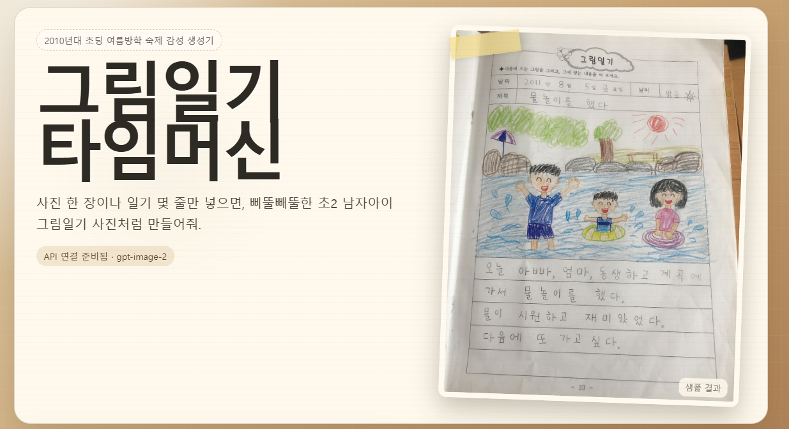
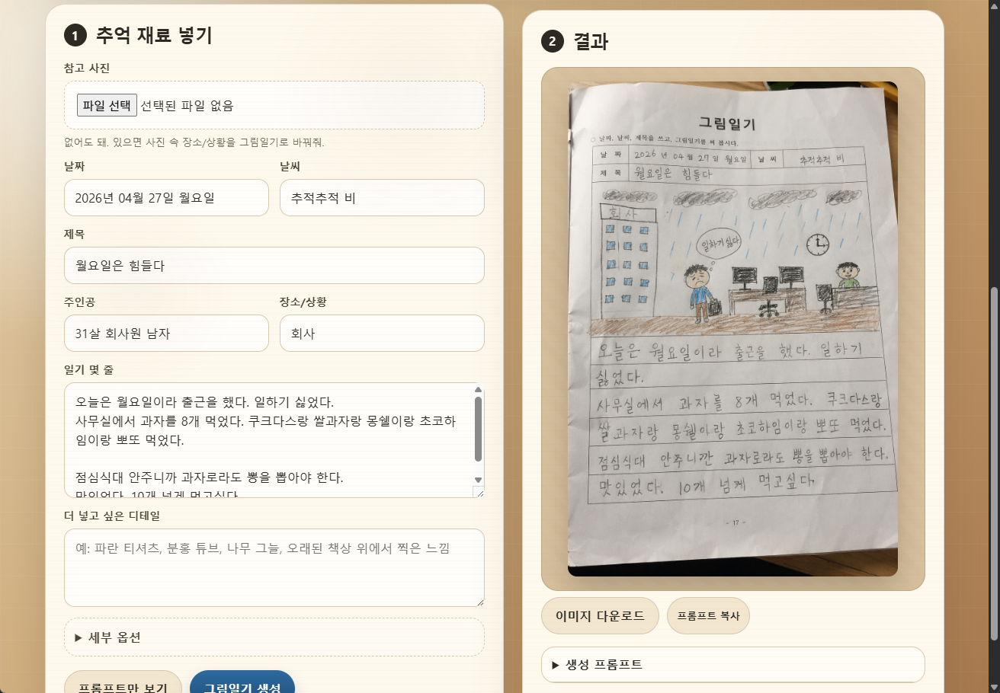
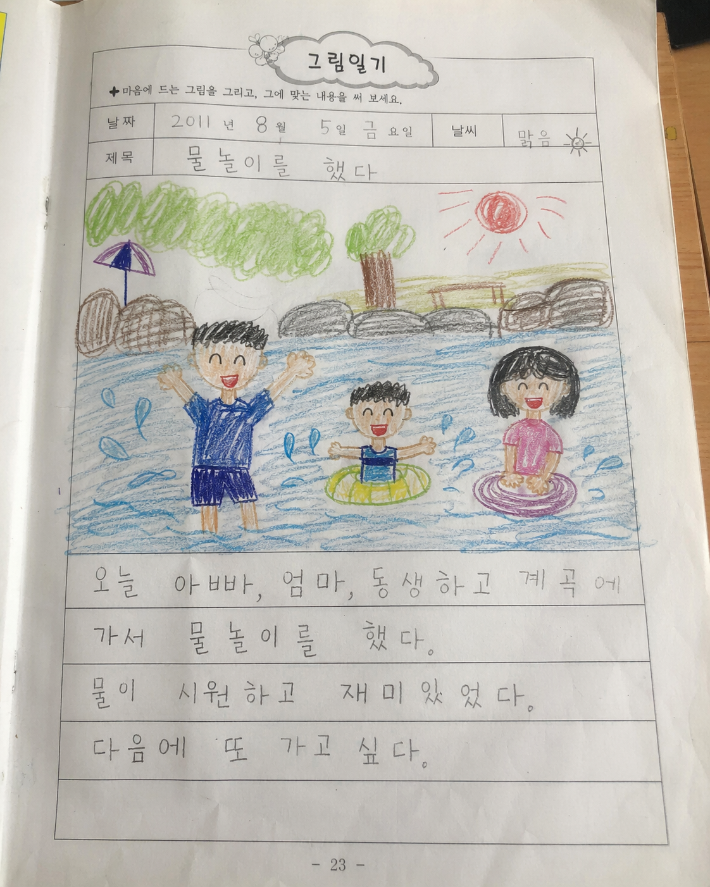
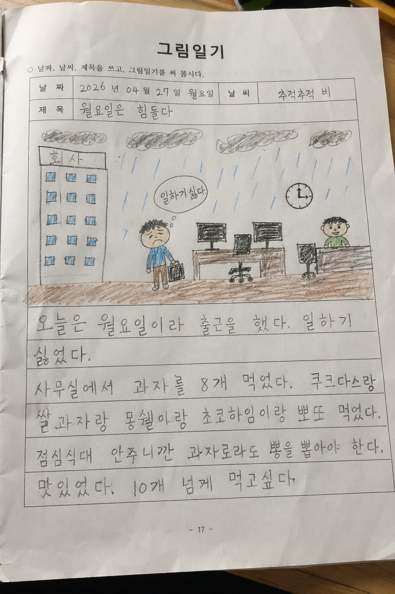

# 그림일기 타임머신

오늘의 별거 아닌 일을 한 줄만 적으면, 2010년대 초등학교 2학년 남자아이의 여름방학 숙제 같은 `그림일기` 이미지로 바꿔주는 작은 리추얼 앱입니다.

처음 보는 분도 바로 감이 오실 수 있도록, 결과 이미지를 앞에 두는 방식으로 정리했습니다.

## 미리 보기

<table>
  <tr>
    <td></td>
    <td></td>
  </tr>
  <tr>
    <td></td>
    <td></td>
  </tr>
</table>

## 이 앱이 하는 일

- 오늘 한 줄 입력
- 선택 사진 업로드
- 오늘 일기 분위기 3종 선택
- 하루 1장 + 지우개 찬스 1번 제한
- 초등학생 그림일기 감성 내부 지시문 생성
- OpenAI Image API로 이미지 생성
- 결과 이미지 다운로드
- 공유 문구 복사
- 도장 반응
- 로컬 기준 연속 기록 보상
- Google, KakaoTalk, Naver OAuth 로그인
- 로그인한 사용자별 그림일기 저장 및 날짜별 다시 보기
- API 키가 없어도 샘플 이미지는 볼 수 있음

## 실행 방법

Node.js 20 이상이 필요합니다.

```bash
cd picture-diary-time-machine
cp .env.example .env
```

`.env`에 키를 넣어 주세요.

```bash
OPENAI_API_KEY=sk-...
OPENAI_IMAGE_MODEL=gpt-image-2
PORT=8787
SUPABASE_URL=https://your-project.supabase.co
SUPABASE_ANON_KEY=your-supabase-anon-key
```

로그인과 일기장 저장을 사용하려면 Supabase 프로젝트가 필요합니다.

1. Supabase에서 새 프로젝트를 만듭니다.
2. `supabase.schema.sql` 내용을 SQL Editor에서 실행합니다.
3. Authentication Providers에서 Google과 Kakao를 활성화합니다.
4. Naver는 Supabase 기본 제공 Provider 목록에 없으므로 Custom OAuth/OIDC Provider로 `custom:naver`를 만들어 연결합니다.
5. 카카오톡 공유 버튼을 공식 공유 화면으로 열려면 Kakao Developers의 JavaScript 키를 `KAKAO_JAVASCRIPT_KEY`에 넣고, 배포 도메인을 JavaScript SDK 도메인/제품 링크 웹 도메인에 등록합니다.
6. Vercel 환경 변수에도 `SUPABASE_URL`, `SUPABASE_ANON_KEY`, `KAKAO_JAVASCRIPT_KEY`를 추가합니다.

실행:

```bash
npm start
```

브라우저에서 열기:

```bash
http://localhost:8787
```

## 한 줄 요약

이 프로젝트는 별거 아닌 오늘 하루를 진짜 초등학생 방학숙제장 같은 그림일기로 바꿔주는 하루 한 장 기록 앱입니다.

## 배포할 때 주의할 점

- API 키는 절대 프론트엔드에 넣지 않아야 합니다.
- 지금 하루 제한은 클라이언트 로컬 기준입니다.
- 공개 서비스로 만들 경우, 서버 쪽 사용자별 요청 제한, 비용 한도, 업로드 이미지 삭제 정책을 꼭 넣으셔야 합니다.
- 생성 이미지가 실제 과거 숙제처럼 보일 수 있으니, 서비스 설명에 `AI 생성 이미지`라는 안내를 넣는 것이 좋습니다.

## 다음에 하면 좋은 것

- 하루 제한 서버 검증
- 우리 반 일기장/친구 일기장
- 일기장 검색/월별 보기
- Vercel, Render, Fly.io 같은 곳에 배포
